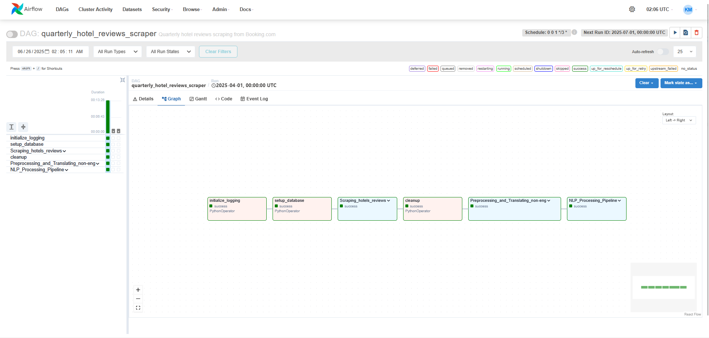
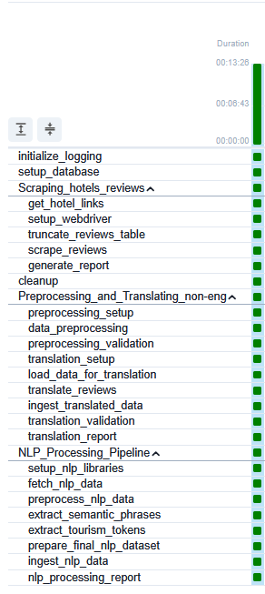

# Smart Tourism Development System

## Project Overview

The Smart Tourism Development System is a comprehensive data-driven solution designed to enhance Egypt's tourism sector through advanced analytics, machine learning, and automated data processing. The system combines web scraping, natural language processing, sentiment analysis, and interactive dashboards to provide actionable insights for tourism stakeholders.

## System Architecture

### Core Components

```
/home/kariem/newapproach/
├── dags/                           # Apache Airflow DAGs
│   ├── scheduled.py                # Main quarterly scraping DAG
│   ├── optimized_scheduled.py      # Optimized version of the DAG
│   └── ultra_optimized_*.py        # Ultra-optimized DAG versions
├── src/                            # Source code modules
│   ├── scrapers/                   # Web scraping components
│   │   └── hotel_scraper.py        # Main hotel scraping engine
│   ├── nlp/                        # Natural Language Processing
│   │   ├── preprocessing_nlp_ref/  # NLP preprocessing pipeline
│   │   │   ├── preprocessing_script.py      # Data preprocessing
│   │   │   ├── translation_local_gpu.py     # Translation pipeline
│   │   │   └── nlp_processing_pipeline.py   # NLP processing
│   │   └── NLP_Script.py           # Main NLP entry point
│   ├── config/                     # Configuration management
│   │   ├── scraping_config.py      # Scraping configurations
│   │   └── webserver_config.py     # Airflow webserver config
│   ├── utils/                      # Utility modules
│   └── Back-up/                    # Backup files and versions
├── config/                         # Root-level configuration
│   ├── scraping_config.py          # Scraping configuration
│   └── optimized_config.py         # Optimized configurations
├── scripts/                        # Standalone execution scripts
│   ├── manual_scraper.py           # Manual scraping utility
│   ├── test_firefox.py             # Browser testing
│   └── installation scripts        # Setup utilities
├── tests/                          # Comprehensive test suite
├── Documentation/                  # Project documentation
├── data/                           # Data storage directory
├── logs/                           # Application logs
├── Home.py                         # Streamlit dashboard application
├── airflow_env/                    # Virtual environment
├── webserver_config.py             # Airflow webserver configuration
└── airflow.cfg                     # Airflow configuration
```

## Documentation & Visual Resources

The project includes comprehensive documentation and visual resources:

### 📋 Project Documentation
- **Smart_Tourism_Requirements_Document.pdf**: Complete requirements specification
- **SmartTourismDevSys_Proposal.pdf**: Project proposal and overview
- **Smart_Tourism_Dev_Sys-documention_V3.docx**: Detailed technical documentation
- **IMPLEMENTATION_DOCUMENTATION.md**: Implementation details and setup guide

### 📊 System Diagrams & Architecture
- **System Architecture.png**: High-level system architecture overview
- **DataFlowDiagramV2.1.png**: Data flow visualization
- **SequenceDiagram_V2.0.png**: System interaction sequences
- **ClassDiagram v3.jpg**: Object-oriented design structure
- **UseCaseDiagram_V2.2.png**: Use case specifications

### 🗄️ Database Design
- **Database Schema.jpg**: Database structure and relationships
- **StarSchema_erd.png**: Star schema for analytics
- **Web-DashBoard-ERD.png**: Dashboard database design
- **RawDataStorage_ERD.png**: Raw data storage schema

### 🔄 Process Flow Diagrams
- **NLP_activity_diagram_v2.1.png**: NLP processing workflow
- **ScrapingActivityDaigram_v2.0.png**: Web scraping process flow

### 🔄 Apache Airflow DAG Screenshots
- **image.png**: Airflow DAG interface and task visualization
- **image1.png**: DAG execution and monitoring dashboard


*Airflow DAG interface showing the Smart Tourism data pipeline tasks and dependencies*


*DAG execution monitoring dashboard with task status and performance metrics*

### 🎨 Dashboard Screenshots
- **Charts Page.jpg**: Analytics and visualization page
- **Full view page.jpg**: Detailed data view
- **Selecting City Page.jpg**: City selection interface
- **Strat Page.jpg**: Strategy and planning interface

## Technology Stack

### Backend Infrastructure
- **Apache Airflow**: Workflow orchestration and scheduling
- **PostgreSQL**: Primary data storage (Neon cloud database)
- **Python 3.12**: Core programming language
- **Selenium**: Web scraping automation
- **BeautifulSoup**: HTML parsing

### Data Processing & Analytics
- **Pandas**: Data manipulation and analysis
- **NLTK**: Natural language processing
- **Deep Translator**: Multi-language translation
- **SQLAlchemy**: Database ORM

### Frontend & Visualization
- **Streamlit**: Interactive web dashboard
- **Plotly Express**: Data visualization
- **Dash Framework**: Advanced dashboard components

### Machine Learning & NLP
- **Sentiment Analysis**: Review sentiment classification
- **Text Preprocessing**: Advanced text cleaning and normalization
- **Language Detection**: Multi-language support
- **Translation Pipeline**: Automated translation services

## Smart Tourism Development System

### Project Overview

The Smart Tourism Development System is a data-driven solution designed to improve Egypt's tourism sector by leveraging advanced analytics and machine learning. It analyzes tourist feedback to provide actionable insights for stakeholders, fostering enhanced tourist experiences and competitive advantage.

## Key Features

### 🔄 Automated Data Collection
- **Quarterly Scraping Pipeline**: Automated collection of hotel reviews using Apache Airflow
- **Multi-source Data Gathering**: Reviews from major travel platforms
- **Real-time Data Processing**: Continuous data ingestion and processing
- **Scalable Architecture**: Handles large volumes of tourism data

### 🧠 Advanced NLP & Analytics
- **Sentiment Analysis**: Automated classification of tourist feedback (positive/negative)
- **Multi-language Support**: Translation pipeline for global review processing
- **Text Preprocessing**: Advanced cleaning, normalization, and feature extraction
- **Pain Point Identification**: Automated detection of recurring issues and highlights

### 📊 Interactive Dashboards
- **Streamlit Web Interface**: User-friendly data exploration and visualization
- **Role-based Views**: Tailored interfaces for different stakeholder types
- **Real-time Analytics**: Live data visualization and reporting
- **Exportable Reports**: PDF and CSV export capabilities

### 🎯 Business Intelligence
- **Competitor Analysis**: Benchmarking against other destinations
- **Predictive Analytics**: Trend forecasting and opportunity identification
- **Development Planning**: Data-driven improvement recommendations
- **Performance Tracking**: Tourism metrics monitoring and reporting

## Quick Start Guide

### 1. Environment Setup
```bash
# Navigate to project directory
cd /home/kariem/newapproach

# Activate virtual environment
source airflow_env/bin/activate

# Install dependencies
pip install -r requirments/requirements.txt
```

### 2. Start Apache Airflow
```bash
# Initialize Airflow (first time only)
airflow db init

# Start Airflow webserver and scheduler
airflow standalone
# Access web UI at: http://localhost:8080
```

### 3. Launch Dashboard
```bash
# Start Streamlit dashboard
streamlit run Home.py
# Access dashboard at: http://localhost:8501
```

### 4. Manual Data Collection
```bash
# Run manual scraping with different presets
cd scripts

# Development mode (5 hotels, 2 pages, visible browser)
python manual_scraper.py --preset development

# Testing mode (10 hotels, 3 pages, headless)
python manual_scraper.py --preset testing

# Production mode (50 hotels, 5 pages, headless)
python manual_scraper.py --preset production
```

## Configuration Management

### Scraping Presets
| Preset | Hotels | Pages/Hotel | Headless | Use Case |
|--------|--------|-------------|----------|----------|
| `development` | 5 | 2 | No | Local testing & debugging |
| `testing` | 10 | 3 | Yes | Integration testing |
| `production` | 50 | 5 | Yes | Production data collection |

### Database Configuration
- **Primary Database**: PostgreSQL (Neon Cloud)
- **Connection**: Secure SSL connection
- **Data Schema**: Bronze → Silver → Gold tier architecture
- **Backup**: Automated daily backups

## Data Processing Pipeline

### 1. Data Collection (Bronze Tier)
- Raw hotel review scraping
- Multi-platform data gathering
- Data validation and quality checks
- Initial storage in bronze tables

### 2. Data Processing (Silver Tier)
- Text preprocessing and cleaning
- Language detection and translation
- Sentiment analysis and classification
- Data standardization and normalization

### 3. Analytics Ready (Gold Tier)
- Aggregated metrics and KPIs
- Processed insights and trends
- Dashboard-ready data views
- Exportable analytical datasets

## Architecture Highlights

### Scalability Features
- **Modular Design**: Loosely coupled components for easy scaling
- **Containerization Ready**: Docker-compatible architecture
- **Cloud Native**: Designed for cloud deployment
- **Load Balancing**: Distributed processing capabilities

### Data Quality Assurance
- **Comprehensive Testing**: Full test suite for all components
- **Data Validation**: Multi-layer validation processes
- **Error Handling**: Robust error recovery mechanisms
- **Monitoring**: Real-time system health monitoring

### Development & Optimization Versions
- **v1/**: Initial optimization implementations
  - `optimized_preprocessing.py`: First-generation optimized data processing
  - `optimized_translation.py`: Enhanced translation pipeline
  - `optimized_config.yaml`: Configuration optimization
- **v2/**: Ultra-optimized versions
  - `ultra_optimized_hotel_scraper.py`: High-performance scraping engine
  - `ultra_optimized_nlp_pipeline.py`: Advanced NLP processing
  - `ultra_optimized_preprocessing.py`: Maximum efficiency preprocessing
  - `ultra_optimized_translation.py`: Ultra-fast translation pipeline
- **Root-level Development Files**: Working versions for testing and development

## Deployment Options

### Local Development Environment
- **Project Location**: `/home/kariem/newapproach/`
- **Virtual Environment**: `airflow_env/` (primary) or `airflow_venv/` (alternative)
- **Database**: SQLite for local testing, PostgreSQL for production
- **Airflow Instance**: Standalone Airflow instance
- **Dashboard**: Local Streamlit server
- **Activation Script**: `activate_venv.sh` for quick environment setup

### Production Deployment
- **Database**: PostgreSQL cloud database (Neon Cloud)
- **Airflow**: Distributed Airflow cluster
- **Web Applications**: Containerized applications
- **Load Balancer**: Configuration ready for scaling
- **Environment Management**: Multiple configuration presets available

## Target Stakeholders

### 🏛️ Government & Tourism Authorities
- **Strategic Planning**: Data-driven policy development and resource allocation
- **Performance Monitoring**: Tourism sector KPI tracking and benchmarking
- **Investment Decisions**: Evidence-based infrastructure and service investments
- **Regulatory Insights**: Understanding market dynamics and visitor needs

### 🏨 Tourism Operators & Businesses
- **Service Optimization**: Real-time feedback integration for service improvements
- **Competitive Intelligence**: Market positioning and competitor analysis
- **Customer Experience**: Understanding visitor satisfaction and pain points
- **Revenue Optimization**: Data-driven pricing and service strategies

### 🎓 Research & Academic Institutions
- **Tourism Research**: Comprehensive datasets for academic studies
- **Trend Analysis**: Long-term tourism pattern identification
- **Economic Impact**: Tourism sector contribution analysis
- **Innovation Development**: Technology advancement in tourism analytics

## Sustainable Development Impact

### 📈 Economic Growth
- **Revenue Enhancement**: Improved tourism experiences leading to increased visitor spending
- **Job Creation**: Tourism sector expansion and employment opportunities
- **Investment Attraction**: Data-driven insights attracting tourism investments
- **SME Support**: Empowering small tourism businesses with market intelligence

### 🏛️ Cultural Preservation
- **Heritage Site Monitoring**: Visitor impact assessment on historical sites
- **Cultural Experience Enhancement**: Improving cultural tourism offerings
- **Sustainable Tourism**: Balancing preservation with visitor experience
- **Community Engagement**: Local community involvement in tourism development

### 🌍 Environmental Sustainability
- **Sustainable Practices**: Promoting eco-friendly tourism initiatives
- **Resource Management**: Optimizing tourism infrastructure usage
- **Impact Assessment**: Environmental impact monitoring and mitigation
- **Green Tourism**: Supporting sustainable tourism development

## Technical Specifications

### Technology Stack

#### Backend Infrastructure
- **Database**: PostgreSQL (Neon Cloud)
- **Programming Language**: Python 3.12
- **Web Framework**: Streamlit + Dash
- **Workflow Orchestration**: Apache Airflow 2.8.4

#### Data Processing & Analytics
- **Data Manipulation**: Pandas 2.1.4
- **NLP Libraries**: NLTK 3.8.1, Deep Translator
- **Web Scraping**: Selenium 4.15.2, BeautifulSoup
- **Database ORM**: SQLAlchemy, psycopg2-binary

#### Machine Learning & Analytics
- **Sentiment Analysis**: Custom NLP pipeline
- **Translation**: Multi-language translation support
- **Text Processing**: Advanced preprocessing and normalization
- **Visualization**: Plotly Express, interactive charts

### System Requirements
- **Python**: 3.12+
- **Operating System**: Linux (Ubuntu 20.04+ recommended)
- **Memory**: 8GB RAM minimum, 16GB recommended
- **Storage**: 50GB available space
- **Network**: Stable internet connection for data collection

## Project Status & Development Roadmap

### ✅ Completed Phases
| Phase | Version | Deliverables | Status |
|-------|---------|-------------|--------|
| Phase 1 | v0.1 | Initial project setup & architecture | ✅ **Completed** |
| Phase 2 | v0.2 | Local data scraping implementation | ✅ **Completed** |
| Phase 3 | v0.3 | NLP preprocessing & sentiment analysis | ✅ **Completed** |
| Phase 4 | v1.0 | Cloud database deployment & optimization v1 | ✅ **Completed** |
| Phase 5 | v1.2 | Performance optimization iterations | ✅ **Completed** |
| Phase 6 | v2.0 | Ultra-optimized implementations | ✅ **Completed** |
| Phase 7 | v2.1 | Full web application deployment | ✅ **Completed** |

### 🚧 Current Development (v2.2)
- [x] **Multiple DAG Versions**: Optimized and ultra-optimized Airflow DAGs
- [x] **Comprehensive Documentation**: Full system documentation and diagrams
- [x] **Performance Testing**: Ultra-optimization validation and testing
- [ ] **Enhanced Analytics**: Advanced statistical analysis and reporting
- [ ] **Real-time Processing**: Live data streaming and processing
- [ ] **API Development**: RESTful API for external integrations

### 🔮 Future Enhancements (v3.0+)
- [ ] **AI-Powered Insights**: Machine learning recommendation engine
- [ ] **Predictive Analytics**: Tourism trend forecasting models
- [ ] **Multi-source Integration**: Social media and review platform expansion
- [ ] **Real-time Alerts**: Automated issue detection and notification system
- [ ] **Advanced Security**: Enhanced data protection and access controls

## Team & Academic Supervision

### Core Development Team
- **Kariem Abdelmoniem Ahmed** - Project Lead & Data Engineering
- **Mohamed Ashraf Mohamed** -  Frontend Development & Data Analytics
- **Kirolos Raouf Helmy** - NLP & Machine Learning 
- **Ahmed Mohamed Nabil** - Frontend Development & Data Analytics
- **Abdelrahman Mohamed Abdelnaby** - Backend & Quality Assurnce 
- **Mahmoud Mohamed Sharfy** - Frontend Development & Data Analytics

### Academic Supervision
- **Dr. Mohamed Fouad** - Project Supervisor & Technical Advisor

## License & Contact

This project is developed for academic and research purposes. For technical support, feature requests, or collaboration opportunities, please contact the development team through the project repository or academic institution channels.

---

*Smart Tourism Development System - Enhancing Egypt's Tourism Through Data-Driven Intelligence*

